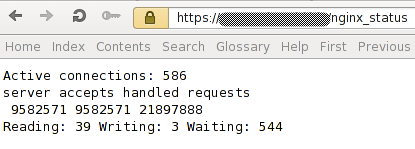
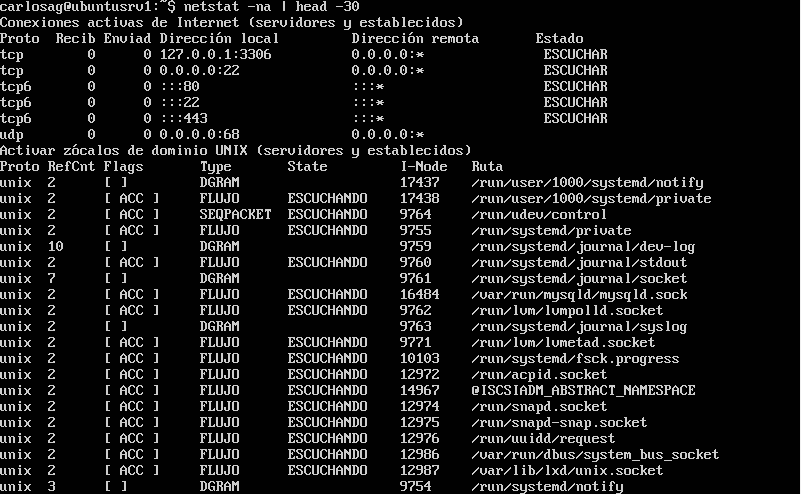

# Tema 5: Medir prestaciones.

## Ejercicio 5.1:
**Buscar información sobre cómo calcular el número de
conexiones por segundo.
Para empezar, podéis revisar las siguientes webs:**  

[Enlace1](http://bit.ly/1ye4yHz)  
[Enlace2](http://bit.ly/1PkZbLJ)

### Nginx
Para Nginx existe un módulo llamado HttpStubStatusModule que al configurar en el servidor de nginx, accediendo a través de http://direccionservir/nginx_status, nos visualiza cierta información dentro de la que están incluidas las conexiones por segundo:

### Linux

En linux podemos observar las conexiones actuales con la orden: ``netstat -na``:

- - -  
## Ejercicio 5.2:
**Revisar los análisis de tráfico que se ofrecen en: http://bit.ly/1g0dkKj**

**Instalar wireshark y observar cómo fluye el tráfico de red en uno de los servidores web mientras se le hacen peticiones HTTP.**

- - -  
## Ejercicio 5.3:
**Buscar información sobre características, disponibilidad para diversos SO, etc. de herramientas para monitorizar las prestaciones de un servidor.
Para empezar, podemos comenzar utilizando las clásicas de Linux:**
* Top
* Vmstat
* Netstat
