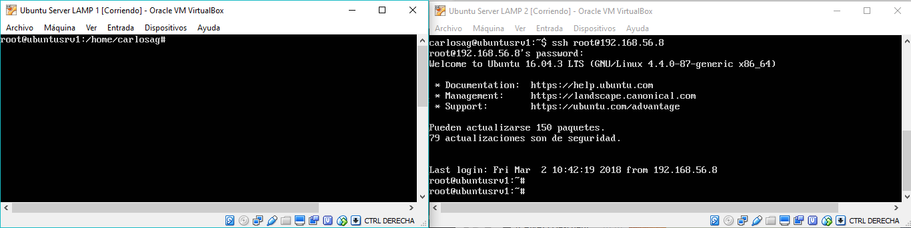
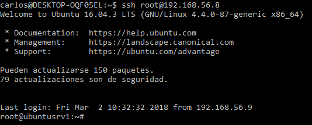
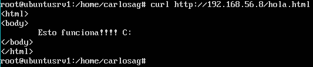

# Práctica 1. Preparación de las herramientas
## Cuestiones a resolver

En esta práctica el objetivo es configurar las máquinas virtuales para trabajar en prácticas posteriores, asegurando la conectividad entre dichas máquinas.
Como resultado de la práctica 1 se mostrarán dos máquinas funcionando al profesor en clase (accesos con curl para solicitar páginas web sencillas, así como el
acceso por SSH entre ambas máquinas).
Específicamente, hay que llevar a cabo las siguientes tareas:
1. Acceder por ssh de una máquina a otra
2. Acceder mediante la herramienta curl desde una máquina a la otra

El resultado de ejecutar estas tareas se debe documentar usando un archivo de texto y/o capturas de pantalla que se subirán a la cuenta de GitHub.

- - -

## Desarrollo

Para la elaboración de la práctica, hemos instalado una máquina con Ubuntu Server, utilizando [VirtualBox](https://www.virtualbox.org).

Debemos de realizar instalación completa de servidor web: Apache + MySQL + PHP (LAMP) siguiendo estos pasos [pasos](http://www.ubuntugeek.com/step-by-step-ubuntu-12-04-precise-lamp-server-setup.html).

Clonamos una máquina para tener otra con la misma configuración que la otra.

- - -

## Configuración

Tras la instalación debemos configurar una nueva interfaz de red (HostOnly) para poder comunicar ambas máquina entre sí, estableciendo una ip estática a cada una de ellas. Para configurarlo:

1. Modificar el archivo alojado `/etc/network/interfaces` añadiendo estas líneas:

```
    auto enp0s8
    iface enp0s8 inet static
    address IPserver
    netmask 255.255.255.0
```

Las direcciones IP deben ser diferentes.

2. Reiniciamos la red para aplicar los cambios:
```
etc/init.d/networking restart
```

3. Comprobamos la conexión:
```
 ping IPserver
```

Para poder conectarnos a las máquinas vistuales vamos a realizarlo con ssh.

1. Generamos la llave pública y privada:

```
    ssh-keygen
```

2. Modificamos el archivo ` /etc/ssh/sshd_config` para permitir el acceso a root:

```
    PermitRootLogin yes
```

3. Compartimos la llave pública con la otra máquina:

```
    ssh-copy-id root@IPserver
```

Con esto nos evitamos escribir la contraseña cada vez qu establecemos una conexión

4. Accedemos a la otra máquina:

```
    ssh root@IPserver
```

En nuestro caso, hemos realizado estos pasos en la máquina anfitriona a las máquinas virtuales.

- - -

## Cuestiones a resolver

1. Acceder por ssh de una máquina a otra  

```
    ssh root@direccionIPserver    
```  



Acceder desde la máquina anfitrión a una máquina    

```
    ssh root@direccionIPserver   
```  



2. Acceder mediante la herramienta curl desde una máquina a la otra     

```
    curl http://direccionIPserver/hola.html    
```  



- - -
# Grupo

| [](https://github.com/Thejokeri) | [](https://github.com/AGCarlos) |
| :---: | :---: |
| [Fernando Talavera Mendoza](https://github.com/Thejokeri) | [Carlos Ariza García](https://github.com/AGCarlos) |
