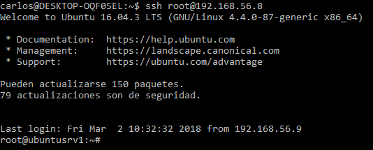
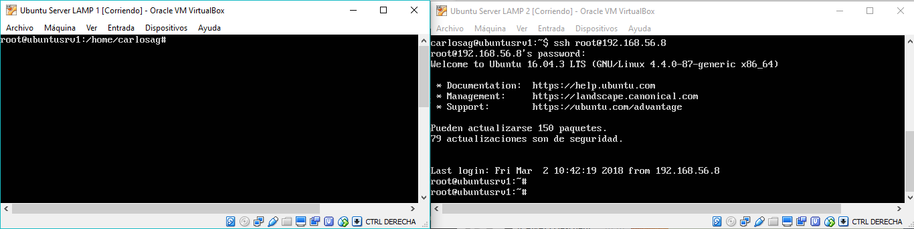
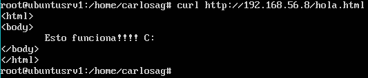

# Práctica 1. Preparación de las herramientas
## Cuestiones a resolver

En esta práctica el objetivo es configurar las máquinas virtuales para trabajar en prácticas posteriores, asegurando la conectividad entre dichas máquinas.
Como resultado de la práctica 1 se mostrarán dos máquinas funcionando al profesor en clase (accesos con curl para solicitar páginas web sencillas, así como el
acceso por SSH entre ambas máquinas).
Específicamente, hay que llevar a cabo las siguientes tareas:
1. Acceder por ssh de una máquina a otra  
`ssh root@direccionIPserver`  

    1.1 Acceder desde la máquina anfitrión a una máquina  
    `ssh root@direccionIPserver`  
    

2. Acceder mediante la herramienta curl desde una máquina a la otra  
`curl http://direccionIPserver/hola.html`  

