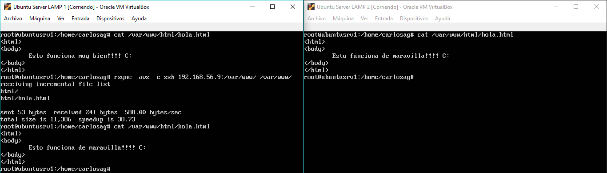
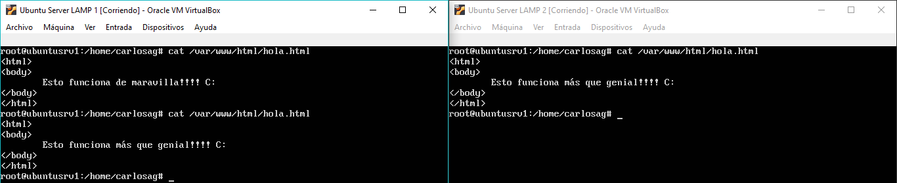

# Práctica 2. Clonar la información de un sitio webs

## Objetivos de la práctica
Los objetivos concretos de esta segunda práctica son:
- Aprender a copiar archivos mediante ssh
- Clonar contenido entre máquinas
- Configurar el ssh para acceder a máquinas remotas sin contraseña
- Establecer tareas en cron

## Cuestiones a resolver

En esta práctica el objetivo es configurar las máquinas virtuales para trabajar en modo espejo, consiguiendo que una máquina secundaria mantenga siempre actualizada la información que hay en la máquina servidora principal.  

Hay que llevar a cabo las siguientes tareas:
1. Probar el funcionamiento de la copia de archivos por ssh  
Utilizamos ssh en conjunto con tar para hacer copias de archivos mediante ssh:
```
tar czf - directorio | ssh equipodestino 'cat > ~/tar.tgz'
```
2. Clonado de una carpeta entre las dos máquinas  
Realizamos la copia de archivos mediate rsync:  
```
  rsync -avz -e ssh ipmaquina:/var/www/ /var/www/
```  
  Previamente habiendo hecho dueño al usuario de la máquina de los directorios que copiamos  
```
  sudo chown usuario:usuario –R /var/www
```  

3. Configuración de ssh para acceder sin que solicite contraseña  

4. Establecer una tarea en cron que se ejecute cada hora para mantener actualizado el contenido del directorio /var/www entre las dos máquinas  
Para esta tarea se añade al final del archivo crontab lo siguiente:  
 `00 * * * * root rsync -avz -e ssh ipmaquina:/var/www/ /var/www/`  
 
Como resultado de la práctica 2 se mostrará al profesor el funcionamiento del proceso automático de clonado de la información. En el documento a entregar se describirá cómo se ha realizado la configuración de ambas máquinas y del software.

- - -
# Grupo

| [](https://github.com/Thejokeri) | [](https://github.com/AGCarlos) |
| :---: | :---: |
| [Fernando Talavera Mendoza](https://github.com/Thejokeri) | [Carlos Ariza García](https://github.com/AGCarlos) |
