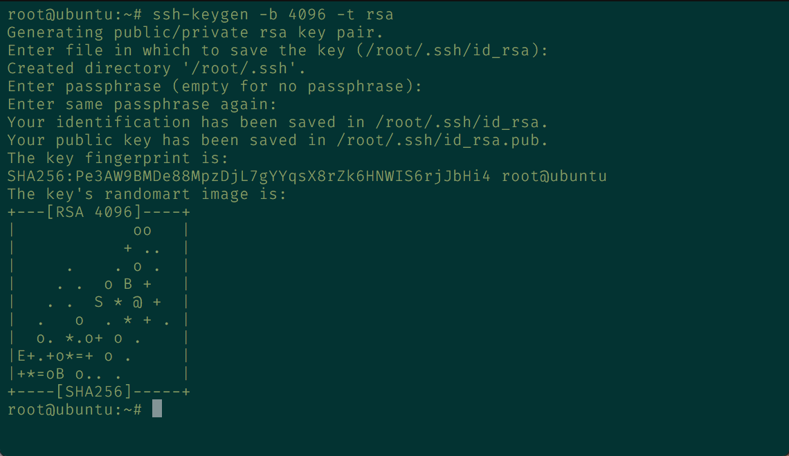
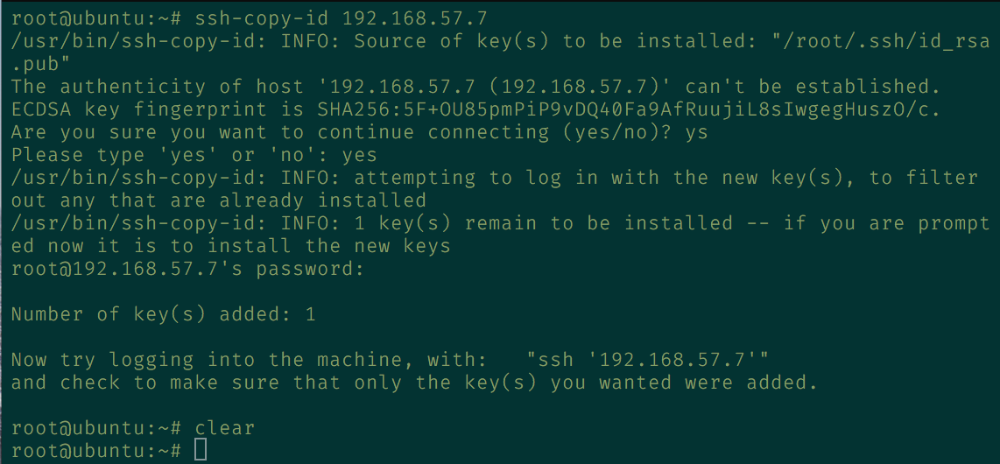
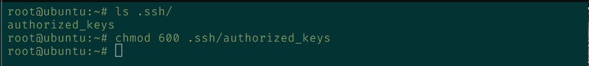

# Práctica 2. Clonar la información de un sitio webs

## Objetivos de la práctica
Los objetivos concretos de esta segunda práctica son:
- Aprender a copiar archivos mediante ssh
- Clonar contenido entre máquinas
- Configurar el ssh para acceder a máquinas remotas sin contraseña
- Establecer tareas en cron

## Cuestiones a resolver

En esta práctica el objetivo es configurar las máquinas virtuales para trabajar en modo espejo, consiguiendo que una máquina secundaria mantenga siempre actualizada la información que hay en la máquina servidora principal.  

Hay que llevar a cabo las siguientes tareas:
1. Probar el funcionamiento de la copia de archivos por ssh  
Utilizamos ssh en conjunto con tar para hacer copias de archivos mediante ssh:
```
    tar czf - directorio | ssh equipodestino 'cat > ~/tar.tgz'
```
2. Clonado de una carpeta entre las dos máquinas  
Realizamos la copia de archivos mediate rsync:  
```
    rsync -avz -e ssh ipmaquina:/var/www/ /var/www/
```  
  Previamente habiendo hecho dueño al usuario de la máquina de los directorios que copiamos  
```
    sudo chown usuario:usuario –R /var/www
```  
  

3. Configuración de ssh para acceder sin que solicite contraseña  

Para ello debemos de generar la llave pública y privada de una de nuestras máquinas

```
    ssh-keygen -b 4096 -t rsa
```


Con esto se nos ha generado la llave pública y privada de nuestra máquina 1, además no le hemos añadido passphrase para que el cron funcione bien.

Después de esto, compartimos la llave pública a nuestra otra máquina con:

```
    ssh-copy-id ipmaquina2
```



Si accedemos a la otra máquina como podemos observar se ha generado el siguiente archivo en la carpeta ~/.ssh/authorized_keys (Le cambiamos el permiso)



Aqui es donde guarda las llaves autorizadas para el acceso de la propia máquina, en nuestro caso guarda la llave pública de la máquina 1.

Ahora nos podemos conectar sin necesidad de introducir la contraseña (en la práctica 1 elaboramos el acceso a ambas máquina mediante root).


4. Establecer una tarea en cron que se ejecute cada hora para mantener actualizado el contenido del directorio /var/www entre las dos máquinas  
Para esta tarea se añade al final del archivo crontab lo siguiente:    

 `00 * * * * root rsync -avz -e ssh ipmaquina:/var/www/ /var/www/`      

 Como resultado se copia el directorio /var/www en la segunda máquina a las 00 de cada hora:  

   

Como resultado de la práctica 2 se mostrará al profesor el funcionamiento del proceso automático de clonado de la información. En el documento a entregar se describirá cómo se ha realizado la configuración de ambas máquinas y del software.

- - -
# Grupo

| [](https://github.com/Thejokeri) | [](https://github.com/AGCarlos) |
| :---: | :---: |
| [Fernando Talavera Mendoza](https://github.com/Thejokeri) | [Carlos Ariza García](https://github.com/AGCarlos) |
