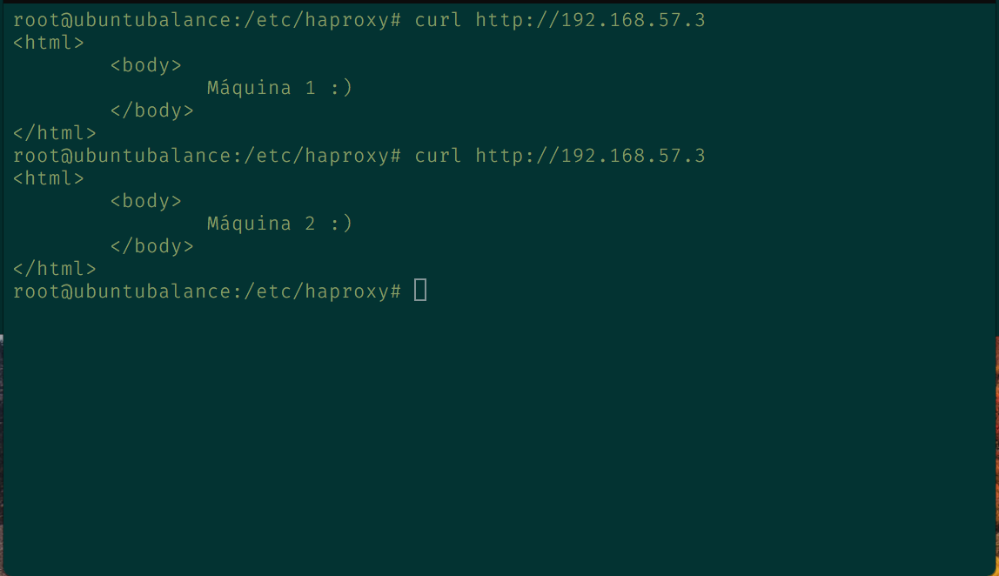
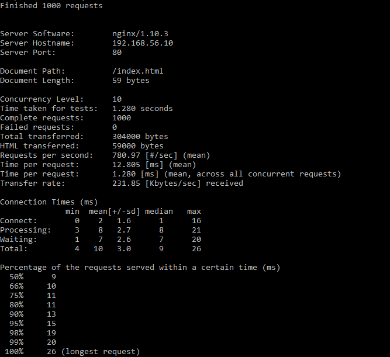
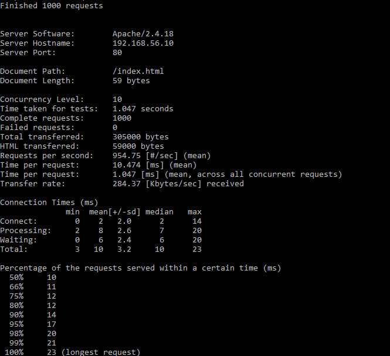
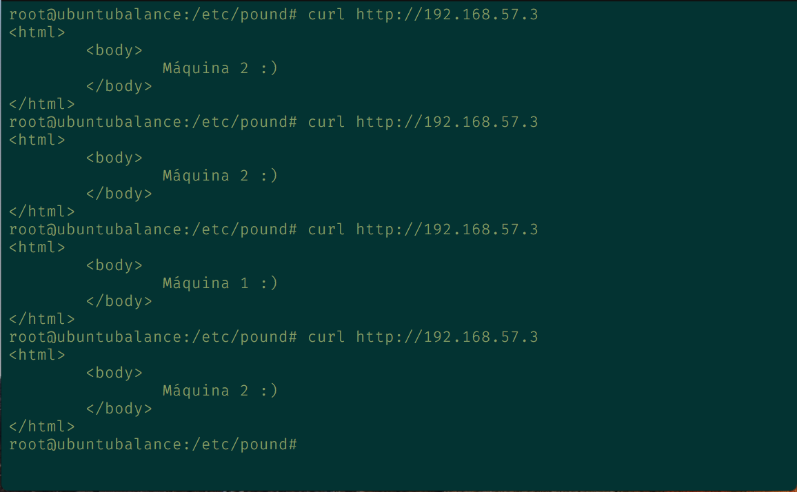

# Práctica 3. Balanceo de carga

## Objetivos de la práctica
En esta práctica configuraremos una red entre varias máquinas de forma que tengamos un balanceador que reparta la carga entre varios servidores finales.  

El problema a solucionar es la sobrecarga de los servidores. Se puede balancear cualquier protocolo, pero dado que esta asignatura se centra en las tecnologías web, balancearemos los servidores HTTP que tenemos configurados.  

De esta forma conseguiremos una infraestructura redundante y de alta disponibilidad.

## Cuestiones a resolver
En esta práctica el objetivo es configurar las máquinas virtuales de forma que dos hagan de servidores web finales mientras que la tercera haga de balanceador de carga por software.  

En esta práctica se llevarán a cabo, como mínimo, las siguientes tareas:
1. **Configurar una máquina e instalar el nginx como balanceador de carga**

  Primero instalamos ubuntu server en la nueva máquina virtual, una vez hecho esto procedemos a la instalacion de nginx:    

  Actualizamos el sistema:
  ```
    sudo apt-get update && sudo apt-get dist-upgrade && sudo apt-get autoremove
  ```
  Instalamos e iniciamos nginx:
  ```
    sudo apt-get install nginx
    sudo systemctl start nginx
  ```  
  Modificamos el fichero de configuración de nginx (/etc/nginx/conf.d/default.conf):

  ```script
  upstream apaches {
    server 172.16.168.130;
    server 172.16.168.131;
  }
  server{
    listen 80;
    server_name balanceador;
    access_log /var/log/nginx/balanceador.access.log;
    error_log /var/log/nginx/balanceador.error.log;
    root /var/www/;
    location /
    {
        proxy_pass http://apaches;
        proxy_set_header Host $host;
        proxy_set_header X-Real-IP $remote_addr;
        proxy_set_header X-Forwarded-For $proxy_add_x_forwarded_for;
        proxy_http_version 1.1;
        proxy_set_header Connection "";
    }
  }
  ```  

  Iniciamos nginx:  
  ```
    sudo systemctl start nginx
  ```  
  Comprobamos que el balanceo de carga funciona con el comando cURL:  
  ```
    curl http://127.0.0.1
    curl http://127.0.0.1
  ```
  Al lanzar este comando nos muestra el index de una máquina seguido del index de la siguiente página, por lo que el balanceo esta funcionando:  

     

  Si queremos que todas las peticiones que vengan de la misma IP se dirijan a la misma máquina debemos añadir al archivo de configuración la opcion ip_hash en el apartado de upstream apaches.    

  Por último si queremos que se realice una conexión con una persistencia de múltiples peticiones HTTP añadimos al archivo de configuracion la opción keepalive [segundos]  

2. **Configurar una máquina e instalar el haproxy como balanceador de carga**  

  En primer lugar, instalamos haproxy en nuestra máquina balanceadora:

   ```
    apt-get install haproxy
   ```
  Una vez instalado, configuramos el archivo `/etc/haproxy/haproxy.cfg` añadiendo lo siguiente:

  ```script
  global
    daemon
    maxconn 256
  defaults
    mode http
    contimeout 4000
    clitimeout 42000
    srvtimeout 43000
  frontend http-in
    bind *:80
    default_backend servers
  backend servers
    server m1 ip_maquina1:80 maxconn 32
    server m2 ip_maquina2:80 maxconn 32
  ```
  Una configurado el haproxy, lanzamos el haproxy mediante el comando:

  ```
    sudo /usr/sbin/haproxy -f /etc/haproxy/haproxy.cfg
  ```
  (Aparecen warnings por algunas líneas por que están obsoletas).

Probamos el balanceador:



3. **Someter a la granja web a una alta carga, generada con la herramienta Apache Benchmark, teniendo primero nginx y después haproxy.**  

  Sometemos a la granja web, primero con el balanceador Nginx, a una carga simulada con Apache Benchmark, obteniendo estos resultados:   
  ```
    ab -n 1000 -c 10 http://IP/index.html
  ```

    

  Posteriormente sometemos a la granja web con el balanceador Haproxy, a una carga simulada con Apache Benchmark, obteniendo estos resultados:   

    

  Comparando los resultados podemos observar que el balanceador HaProxy obtiene mejores resultados en tiempo que Nginx.

### Ejercicio adicional

4. **Configuración de Pound en el balanceador**

  Instalamos Pound:

  ```
    apt-get install pound
  ```

  Modificamos el archivo `/etc/pound/pound.cfg` añadiendo lo siguiente:

  ```script
    ListenHTTP
	    Address IP_balance
	    Port	80

	    ## allow PUT and DELETE also (by default only GET, POST and HEAD)?:
	    xHTTP		0

	  Service
		  BackEnd
			  Address	ip_maquina1
			  Port	80
		  End
		  BackEnd
			  Address ip_maquina2
			  Port	80
		  End
	  End
  End
  ```

  Introducimos el siguiente comando:

  ```
    sed -i -e "s/^startup=0/startup=1/" /etc/default/pound
  ```

  Y lo probamos:

  
  - - -
  # Grupo

  | [](https://github.com/Thejokeri) | [](https://github.com/AGCarlos) |
  | :---: | :---: |
  | [Fernando Talavera Mendoza](https://github.com/Thejokeri) | [Carlos Ariza García](https://github.com/AGCarlos) |
