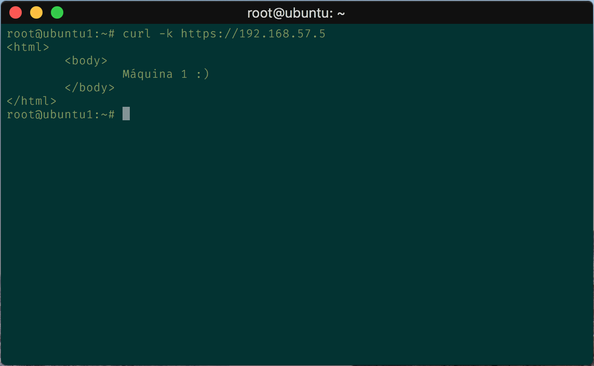
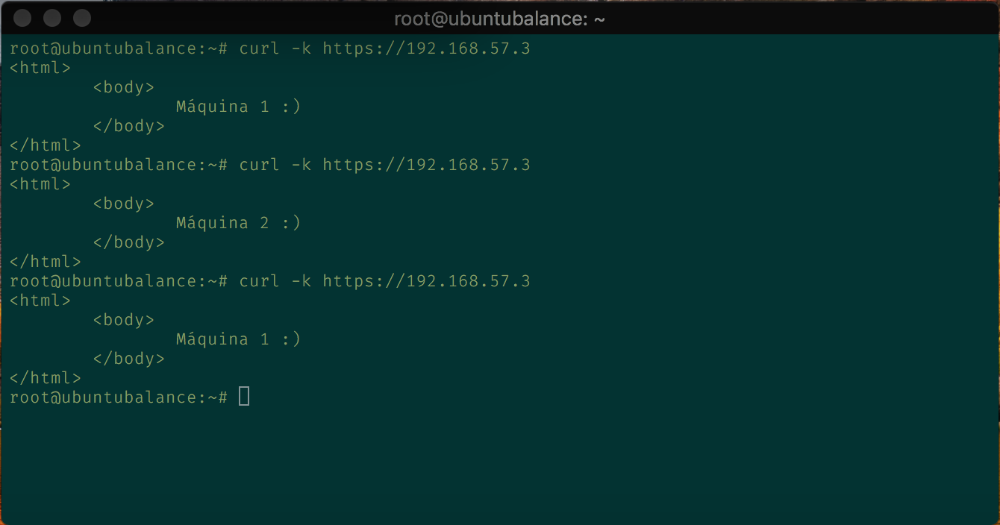
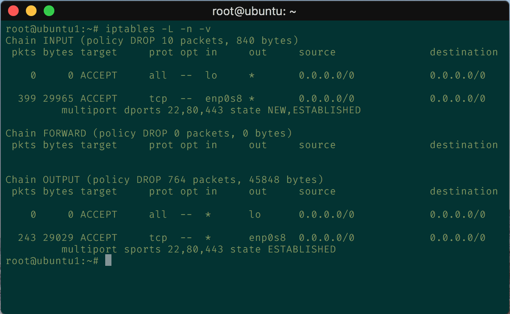

# Práctica 4. Asegurar la granja web

## Objetivos de la práctica

El objetivo de esta práctica es llevar a cabo la configuración de seguridad de la granja web. Para ello, llevaremos a cabo las siguientes tareas:

- Instalar un certificado SSL para configurar el acceso HTTPS a los servidores.
- Configurar las reglas del cortafuegos para proteger la granja web.

## Cuestiones a resolver

El objetivo de esta práctica es configurar todos los aspectos relativos a la seguridad de la granja web ya creada.

Hay que llevar a cabo las siguientes tareas obligatorias:

1. Crear e instalar en la máquina 1 un certificado SSL autofirmado para configurar el acceso HTTPS a los servidores. Una vez configurada la máquina 1, se debe copiar al resto de máquinas servidoras y al balanceador de carga. Se debe configurar nginx adecuadamente para aceptar y balancear correctamente tanto el tráfico HTTP como el HTTPS.

En primer lugar debemos de tener instalado Apache en nuestra máquina:

```bash
  apt install apache2
```

Una vez instalado habilitamos ssl y restauramos el servicio:

```bash
  a2enmod ssl
  service apache2 restart
```

Creamos la carpeta `/etc/apache2/ssl`
Y generamos el certificado mediante este comando:

```bash
  openssl req -x509 -nodes -days 365 -newkey rsa:2048 -keyout /etc/apache2/ssl/apache.key -out /etc/apache2/ssl/apache.crt
```

Nos pedirá que ingresemos una serie de datos, tras esto, modificamos la siguientes líneas debajo de SSLEngine on del archivo `/etc/apache2/sites-available/default-ssl`:

```script
  SSLCertificateFile  /etc/apache2/ssl/apache.crt
  SSLCertificateKeyFile /etc/apache2/ssl/apache.key
```

Activamos el sitio `default-ssl` y reiniciamos apache:

```bash
  a2ensite default-ssl
  service apache2 reload
```

Ahora podemos comprobar con:

```bash
  curl -k https://ipmaquina/index.html
```



Repetimos todo esto en las restantes máquinas. Para configurar el nginx me he seguido de este [tutorial](https://carlosazaustre.es/como-instalar-un-servidor-https-en-nginx-desde-cero/).

Añadimos las siguientes líneas en el archivo de configuración `/etc/nginx/conf.d/default.conf`:

```script
  listen 443 ssl;

  ssl on;
  ssl_certificate /etc/apache2/ssl/apache.crt;
  ssl_certificate_key /etc/apache2/ssl/apache.key;
```

Reiniciamos el servicio y comprobamos con curl:



2. Configurar las reglas del cortafuegos con IPTABLES para asegurar el acceso a uno de los servidores web, permitiendo el acceso por los puertos de HTTP y HTTPS a dicho servidor. Esta configuración se hará en una de las máquinas servidoras finales (p.ej. en la máquina 1), y se debe poner en un script con las reglas del cortafuegos que se ejecute en el arranque del sistema (según la versión de Linux, se llevará a cabo de una forma u otra).

Creamos el script para asegurar el acceso sólo por HTTP, HTTPS y SSH.

Contenido `iptablesconfig.sh`:

```script
#!/bin/sh

# (1) Eliminamos cualquier regla previa que hubiera y cadenas definidas por el usuario

iptables -F
iptables -X
iptables -Z
iptables -t nat -Z

# (2) Se establecen políticas "duras" por defecto, es decir solo lo que se autorice
# explicitamente podrá ingresar o salir del equipo

iptables -P INPUT   DROP
iptables -P OUTPUT  DROP
iptables -P FORWARD DROP

# (3) A la interface lo (localhost) se le permite todo

iptables -A INPUT  -i lo -j ACCEPT
iptables -A OUTPUT -o lo -j ACCEPT

# (4) Establecemos el acceso a HTTP y HTTPS (SHH también para poder acceder)

iptables -A INPUT -i enp0s8 -p tcp -m multiport --dports 22,80,443 -m state --state NEW,ESTABLISHED -j ACCEPT
iptables -A OUTPUT -o enp0s8 -p tcp -m multiport --sports 22,80,443 -m state --state ESTABLISHED -j ACCEPT
```

Una vez creado el script procedemos a cargar el script en el arranque del sistema. Para ello, añadimos un servicio en `/etc/systemd/system/`en mi caso `iptablesconfig.service` con estos permisos `-rwxr-xr-x`.

En el servicio añadimos lo siguiente:

```systemd
[Unit]
Description=Configuracion de IPtables
After=syslog.target

[Service]
Type=oneshot
ExecStart=/root/iptablesconfig.sh

[Install]
RequiredBy=multi-user.target
```

Refrescamos el systemd para que lea de nuevo los servicios:

```bash
  systemctl daemon-reload
```

Y activamos el servicio para el arranque:

```bash
  systemctl enable iptablesconfig.service
```

Reiniciamos el sistema y como podemos comprobar se han ejecutado nuestro script



Adicionalmente, y como primera tarea opcional para conseguir una mayor nota en esta práctica, se propone realizar la instalación de un certificado del proyecto Certbot en lugar de uno autofirmado. Es importante tener en cuenta que para obtener este tipo de certificado, es necesario disponer de un dominio real con IP pública (no se puede hacer en máquinas virtuales).

Como segunda tarea opcional para conseguir una  mayor nota en esta práctica, se propone realizar la configuración del cortafuegos en una cuarta máquina (M4) que se situará delante del balanceador. Esa M4 sólo tendrá configuradas las iptables, para hacer el filtrado y posterior reencaminamiento del tráfico hacia el balanceador. En esta configuración más compleja sólo a esa M4-cortafuegos se le hará la configuración de iptables (el resto de máquinas de la granja tendrá la configuración por defecto, aceptando todo el tráfico como política por defecto.

- - -

# Grupo


  | [](https://github.com/Thejokeri) | [](https://github.com/AGCarlos) |
  | :---: | :---: |
  | [Fernando Talavera Mendoza](https://github.com/Thejokeri) | [Carlos Ariza García](https://github.com/AGCarlos) |
