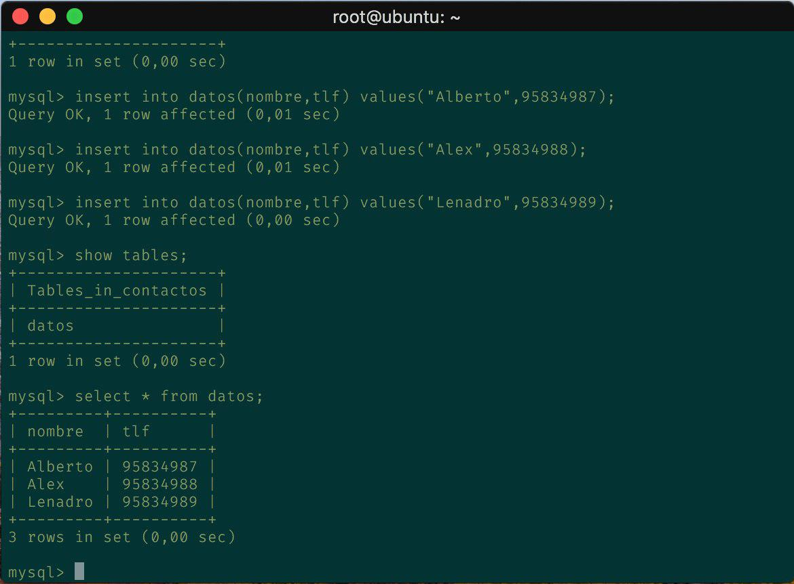
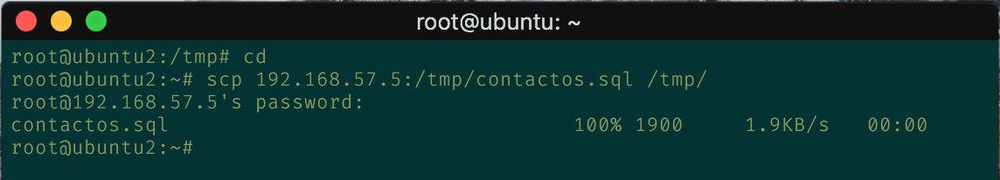
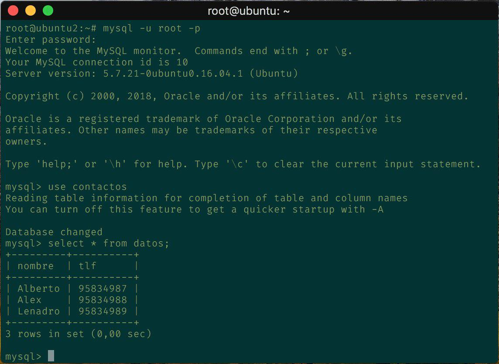
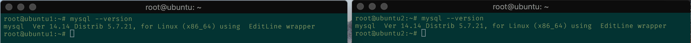
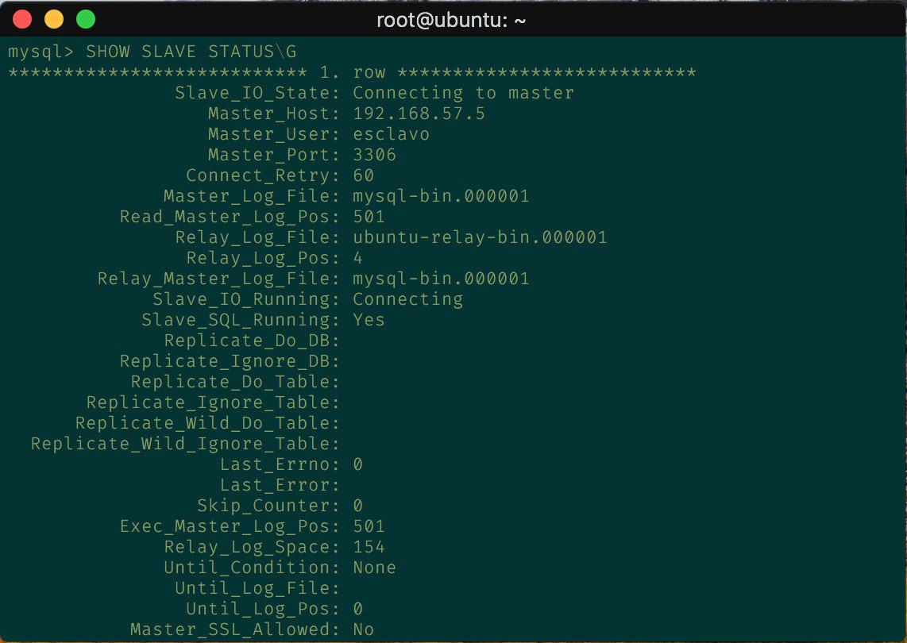
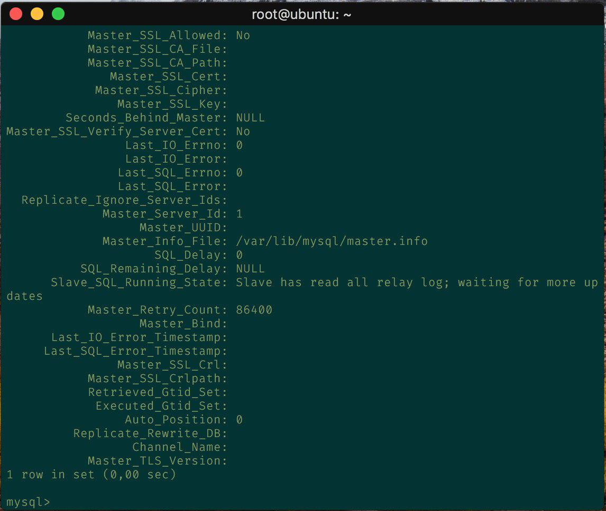
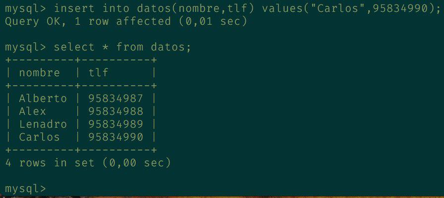
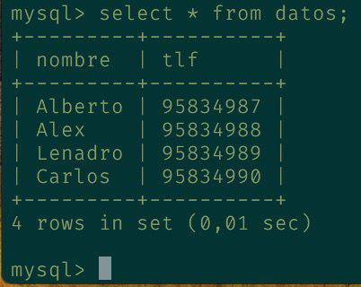

## Práctica 5. Replicación de bases de datos MySQL

## Objetivos de la práctica

A la hora de hacer copias de seguridad de nuestras bases de datos (BD) MySQL, una
opción muy común suele ser la de usar una réplica maestro-esclavo, de manera que
nuestro servidor en producción hace de maestro y otro servidor de backup hace de
esclavo.  

Podemos hacer copias desde el servidor de backup sin que se vea afectado el
rendimiento del sistema en producción y sin interrupciones de servicio.  

Tener una réplica en otro servidor también añade fiabilidad ante fallos totales del
sistema en producción, los cuales, tarde o temprano, ocurrirán. Por ejemplo, podemos
tener un pequeño servidor actuando como backup en nuestra oficina sincronizado
mediante réplicas con nuestro sistema en producción.  

Esta opción, además, añade fiabilidad ante posibles interrupciones de servicio
permanentes del servidor maestro por cualquier escenario catastrófico que nos
podamos imaginar. En ese caso, tendremos posiblemente decenas de clientes y
servicios parados sin posibilidad de recuperar sus datos si no hemos preparado un
buen plan de contingencias. Tener un servidor de backup con MySQL actuando como
esclavo de replicación es una solución asequible y no consume demasiado ancho de
banda en un sitio web de tráfico normal, además de que no afecta al rendimiento del
maestro en el sistema en producción.  

Los objetivos concretos de esta práctica son:
* Copiar archivos de copia de seguridad mediante ssh.
* Clonar manualmente BD entre máquinas.
* Configurar la estructura maestro-esclavo entre dos máquinas para realizar el
clonado automático de la información.

## Cuestiones a resolver  
En esta práctica el objetivo es configurar las máquinas virtuales para trabajar de forma
que se mantenga actualizada la información en una BD entre dos servidores (la
máquina secundaria mantendrá siempre actualizada la información que hay en la
máquina servidora principal).
Hay que llevar a cabo las siguientes tareas obligatorias:  

**1. Crear una BD con al menos una tabla y algunos datos.**    
Entramos en al interfaz de comando de MySQL:  

```
mysql -uroot -p
```  
Introducimos la clave y procedemos a crear una base de datos:  
```
mysql> create database contactos;
```
Creamos una tabla compuesta por nombre y teléfono:
```
mysql> create table datos(nombre varchar(100),tlf int);
```
Mostramos la tabla para comprobar que estar correcta:
```
mysql> show tables;
+---------------------+
| Tables_in_contactos |
+---------------------+
| datos |
+---------------------+
1 row in set (0,00 sec)
```
Introducimos algunos datos en la tabla:
```
mysql> insert into datos(nombre,tlf) values ("Alberto",95834987);
mysql> insert into datos(nombre,tlf) values ("Alex",95834988);
mysql> insert into datos(nombre,tlf) values ("Lenadro",95834989);
```
Mostramos la tabla con los nuevos datos:  


**2. Realizar la copia de seguridad de la BD completa usando mysqldump en la máquina principal y copiar el archivo de copia de seguridad a la máquina secundaria.**     

Antes de realizar la copia de seguridad debemos de evitar que se pueda acceder a la base de datos para que no se actualice, por lo que bloqueamos las tablas:    
```
mysql -u root –p
mysql> FLUSH TABLES WITH READ LOCK;
mysql> quit
```
Ahora utilizamos mysqldump para guardar los datos, desde la primera máquina realizamos:
```
mysqldump contactos -u root -p > /tmp/contactos.sql
```
Y desbloqueamos las tablas:
```
mysql -u root –p
mysql> UNLOCK TABLES;
mysql> quit
```
Ahora vamos a la máquina 2 para copiar el archivo .SQL con todos los datos salvados desde la máquina 1:
```
scp maquina1:/tmp/contactos.sql /tmp/
```
  

**3. Restaurar dicha copia de seguridad en la segunda máquina (clonado manual de la BD), de forma que en ambas máquinas esté esa BD de forma idéntica.**   

Procedemos a importar la BD completa en el MySQL, creando primero una base de datos:
```
mysql -u root –p
mysql> CREATE DATABASE ‘ejemplodb’;
mysql> quit
```
Y restauramos los datos de la BD:
```
mysql -u root -p ejemplodb < /tmp/ejemplodb.sql
```
  Aquí observamos la base de datos de la máquina 1 en la máquina 2:  

  

**4. Realizar la configuración maestro-esclavo de los servidores MySQL para que la replicación de datos se realice automáticamente.**    

En esta captura apreciamos que la versión de ambos es igual  

  
Para realizar esta configuración iniciamos modificando la configuración del maestro en el archivo ``/etc/mysql/mysql.conf.d/mysqld.cnf``:  

Se comenta el parámetro bind-address que sirve para que escuche a un servidor:  

``#bind-address 127.0.0.1``

Le indicamos el archivo donde almacenar el log de errores, donde veremos detalles de los errores:  

``log_error = /var/log/mysql/error.log``  

Establecemos el identificador del servidor:  

``server-id = 1``  

Establecemos también donde guardar el registro binario, que es un formato más eficiente y seguro:  

``log_bin = /var/log/mysql/bin.log``  

Guardamos el documento y reiniciamos el servicio:  

``/etc/init.d/mysql restart``  
Ahora pasamos a la configuración del esclavo en la segunda máquina, para ello, realizamos las mismas modificaciones salvo que en el campo ID indicaremos 2: `` server-id = 2 ``    

Sólo si estamos en versiones de mysql inferiores a la 5.5 deberemos indicar estos datos relativos al master en el archivo de configuración:  
```
Master-host = ipMaestro
Master-user = usuariosDB
Master-password = contraseñaMaestro
 ```    
Finalmente reiniciamos el servicio en el esclavo:  

``/etc/init.d/mysql restart``    

Una vez hecho esto creamos un usuario y le damos permisos de acceso para la replicación. Dentro de mySQL ejecutamos lo siguiente:
```  
mysql> CREATE USER esclavo IDENTIFIED BY 'esclavo';
mysql> GRANT REPLICATION SLAVE ON *.* TO 'esclavo'@'%'
IDENTIFIED BY 'esclavo';
mysql> FLUSH PRIVILEGES;
mysql> FLUSH TABLES;
mysql> FLUSH TABLES WITH READ LOCK;
```  
Con la siguiente orden ``mysql> SHOW MASTER STATUS;`` obtenemos los datos de la BD que necesitaremos para configurar el esclavo.    

    

Ahora en la máquina esclava (máquina 2), entramos en mysql y le introducimos los datos del maestro obtenidos anteriormente:  
```
mysql> CHANGE MASTER TO MASTER_HOST='192.168.31.200',
MASTER_USER='esclavo', MASTER_PASSWORD='esclavo',
MASTER_LOG_FILE='mysql-bin.000001', MASTER_LOG_POS=501,
MASTER_PORT=3306;
```  
Cómo la versión de mySQL es superior a la 5.5, se ha realizado de esta manera, si no se pueden introducir los datos en el archivo de configuración.   

Por último arrancamos el esclavo con lo que concluiríamos la configuración de la réplica entre las dos máquinas:    

``mysql> START SLAVE;``  

Como antes bloqueamos las tablas, volvemos al maestro y volvemos a activarlas para que puedan meterse nuevos datos en el maestro:
```
mysql> UNLOCK TABLES;
```

Para asegurarnos que todos esta bien realizamos:
```
mysql> SHOW SLAVE STATUS\G
```
Y comprobamos que la variable "Seconds_Behind_Master" está a 0, lo que nos indica que todo está bien:  




Vemos cómo se replica la información.

Aquí se muestra la primera máquina:


Aquí se muestra la máquina esclava:


*Adicionalmente, y como tarea opcional para conseguir una mayor nota en esta
práctica, se propone realizar la configuración maestro-maestro entre las dos máquinas
de bases de datos.*  

Como resultado de la práctica 5 se mostrará al profesor el funcionamiento del
proceso de clonado automático de la información entre bases de datos MySQL en las
máquinas principal y secundaria (configuración maestro-esclavo y/o maestro-maestro,
en su caso). En el documento de texto a entregar se describirá en detalle cómo se ha
realizado la configuración de ambos servidores (configuraciones y comandos de
terminal ejecutados en cada momento).
